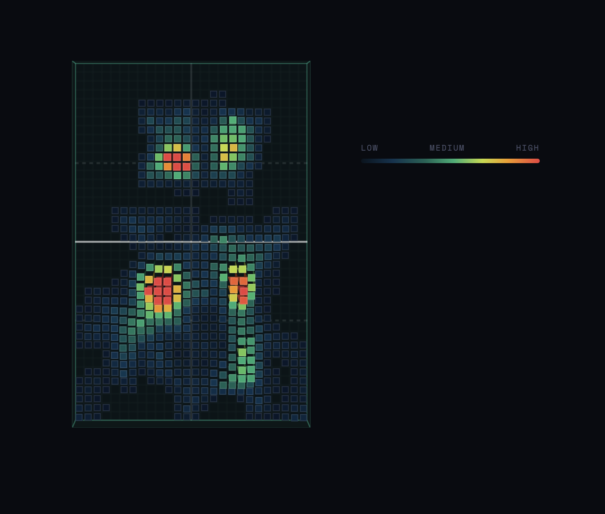
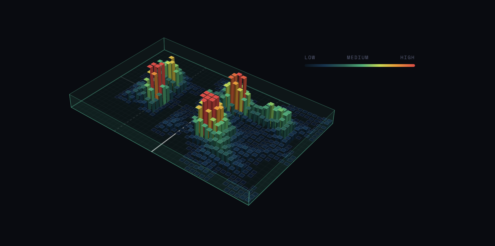

# RallyAI 🏓💻

Most padel players hit a ceiling because they can't see what they're doing wrong. **RallyAI** is a performance platform that turns raw match footage into an analytics dashboard, making professional-level coaching insight accessible to the everyday player.

Upload a video of a match, and RallyAI automatically detects players, classifies their shots, and generates an interactive 3D intensity heatmap of court coverage.




## Features

### Core AI & Analytics

- **Multi-Player Tracking**: Tracks up to 4 players simultaneously with persistent IDs, using centroid-distance matching to survive brief occlusions.
- **Auto Shot Detection**: Automatically classifies *smashes*, *forehands*, and *backhands* by calculating wrist velocity and skeletal positioning frame-by-frame.
- **3D Intensity Heatmap**: A custom-built, interactive court visualization mapping player density and movement "hot zones."
- **Per-Player Breakdown**: Shot counts and type distribution broken down by individual player, not just the match as a whole.
- **Session History**: Exports structured JSON data, including full movement paths and shot timestamps, for session-over-session tracking.

### Tech Stack 🛠️💻

- **Pose detection**: [YOLOv8n-Pose](https://github.com/ultralytics/ultralytics) for keypoint tracking (auto-downloaded on first run).
- **Backend**: FastAPI (Python) - receives uploads, runs the analysis pipeline, and serves results and video playback.
- **Frontend**: React + Vite + Tailwind CSS.
- **Visuals**: Vanilla JS (3D isometric heatmap engine) & Matplotlib (statistical charts: shot timeline, match heatmap PNG).
- A global shot-cooldown mechanism prevents double-counting a single swing as multiple shots.

## Architecture

```
┌─────────────┐      video upload       ┌──────────────┐      subprocess       ┌──────────────┐
│   Frontend   │ ───────────────────────▶│   Backend     │──────────────────────▶│  analyzer.py  │
│ (React/Vite) │                          │  (FastAPI)    │                        │ (YOLOv8-Pose) │
│ localhost:5173│◀───────────────────────│ localhost:8001│◀──────────────────────│               │
└─────────────┘   JSON + heatmap file    └──────────────┘   analysis.json, PNGs  └──────────────┘
```

The frontend never talks to `analyzer.py` directly: it POSTs the video to the FastAPI backend, which saves it, runs `analyzer.py` as a subprocess, reads back the resulting `output/analysis.json`, and returns a summary shaped for the dashboard UI.

## Prerequisites

- **Python 3.10+**
- **Node.js 18+** and npm
- ~500MB free disk space (for Python ML dependencies + the pose model, which downloads automatically on first analysis)
- An internet connection for the *first* run only (to download `yolov8n-pose.pt`)

## Getting Started

### 1. Clone the repo

```bash
git clone https://github.com/2radu3/Rally.AI.git
cd Rally.AI
```

### 2. Backend setup

macOS ships a "system-managed" Python that blocks global `pip install`, so use a virtual environment:

```bash
python3 -m venv venv
source venv/bin/activate        # Windows: venv\Scripts\activate
pip install -r backend/requirements.txt
```

> **Note (macOS):** `ultralytics` requires `numpy<2.0` on macOS specifically (a known Apple/OpenVINO compatibility issue), so `numpy` and `opencv-python` are intentionally left unpinned in `requirements.txt` — pip resolves compatible versions automatically. Don't re-pin them to exact versions unless you also update the constraint.

### 3. Frontend setup

```bash
cd frontend
npm install
cd ..
```

### 4. Run it (two terminals)

**Terminal 1 — backend:**
```bash
source venv/bin/activate
cd backend
uvicorn main:app --reload --port 8001
```

**Terminal 2 — frontend:**
```bash
cd frontend
npm run dev
```

Open the URL Vite prints (usually `http://localhost:5173`) — **not**
`localhost:8001`, which is the API only and has no UI of its own.

### 5. Use it

Upload a padel match video (MP4/MOV). The first analysis will pause briefly to auto-download the YOLO pose model. Processing time depends on video length and your CPU, pose detection runs frame-by-frame and is not currently GPU-accelerated by default, so a multi-minute clip can take several minutes to analyze. 
This is expected; the "Processing AI..." spinner just means it's working.

## Project Structure

```
Rally.AI/
├── analyzer.py           # Core YOLO pose analysis pipeline (called as a subprocess)
├── backend/
│   ├── main.py            # FastAPI server: /analyze, /videos/{id}/{filename}
│   └── requirements.txt
├── data-viz/               # Standalone HTML prototypes (heatmap, performance chart)
├── frontend/
│   ├── src/
│   │   ├── components/     # UploadArea, MainDashboard, PadelHeatmap, etc.
│   │   └── App.jsx
│   └── public/
│       └── heatmap.html    # 3D heatmap renderer, fetches per-match data files
├── output/                 # Generated per-run: analysis.json, heatmap PNGs (gitignored)
├── uploads/                # Uploaded videos, per match ID (gitignored)
└── README.md
```

`output/`, `uploads/`, `venv/`, and `frontend/node_modules/` are all generated at runtime and excluded via `.gitignore` — they're recreated automatically as you use the app.

## API Reference

### `POST /analyze`
Multipart form upload, field name **`video`**. Returns:
```json
{
  "status": "ok",
  "id": "uuid",
  "summary": {
    "total_shots": 12,
    "shots_per_minute": 4.3,
    "duration": 168,
    "total_players": 2,
    "forehand_count": 5,
    "backhand_count": 4,
    "smash_count": 3
  },
  "per_player": {
    "Player 0": { "total": 7, "forehand": 3, "backhand": 2, "smash": 2 }
  },
  "heatmapFile": "heatmap_<uuid>.txt"
}
```

### `GET /videos/{match_id}/{filename}`
Streams back the originally uploaded video for playback in the dashboard.